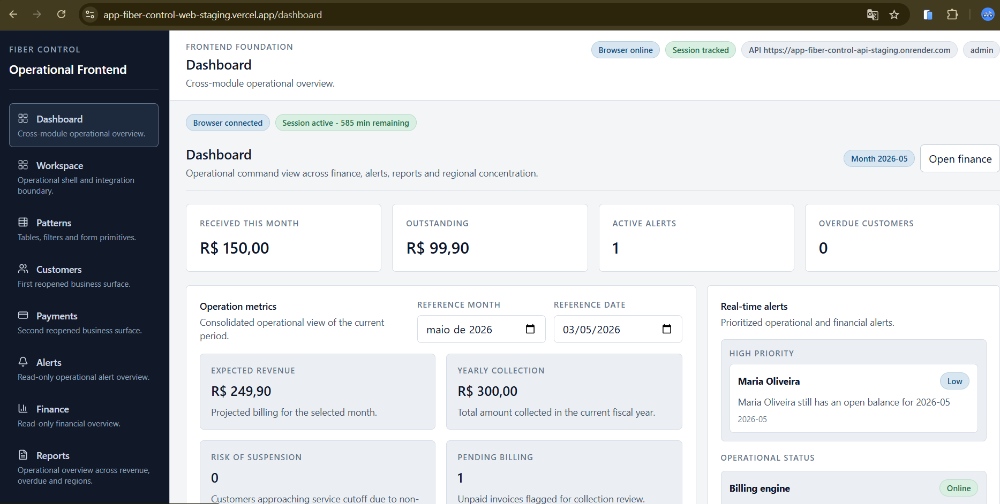

# App Fiber Control

A practical management app for small fiber/internet providers, focused on customers, payments, and overdue visibility.

## Overview

App Fiber Control is a web-based operational management system designed specifically for small Internet Service Providers (ISPs). It simplifies the daily routine of managing fiber customers and their financial cycles, providing a clear view of health and collection performance without the complexity of enterprise ERPs.

## What the project does

The application currently supports the essential management flow:
- **Operator Access**: Secure authentication for operations staff.
- **Customer Management**: Unified listing and detailed view of internet subscribers.
- **Payment Tracking**: Record and monitor monthly billing and payment statuses.
- **Operational Alerts**: Intelligent surfacing of overdue customers and pending payments.
- **Business Dashboard**: High-level visibility of key operational metrics.

## Key Validated Milestones

This project demonstrates software engineering discipline through real-world validation:
- **Staging Infrastructure**: Fully operational API and Web services deployed on Render/Vercel.
- **API Integrity**: Verified health and OpenAPI documentation serving.
- **Authentication Flow**: Validated operator login and secure token handling.
- **Domain Consistency**: Backend established as the single source of truth for overdue customer logic (FC-035).
- **Metric Accuracy**: Resolved data conflicts between Dashboard and Alerts for consistent operational reporting.

## Current Status

**Operational MVP / Portfolio Candidate**

The project is in a stable operational state suitable for demonstration and review. It is an evolving product focused on core ISP management needs, with a strong emphasis on architectural cleaness and delivery rigor.

## Tech Stack

- **Frontend**: Next.js (TypeScript), Tailwind CSS.
- **Backend**: Fastify API (TypeScript).
- **ORM**: Prisma.
- **Database**: PostgreSQL (Neon).
- **Deployment**: Vercel (Web), Render (API), Neon (Managed DB).

## Validation Evidence

Validation was conducted through automated tests and smoke testing in the staging environment:
- **Backend**: 70+ tests passing, covering auth, customers, and alerts.
- **API Health**: Verified via `/health` endpoint in staging.
- **Remote Integration**: Verified connectivity between Vercel, Render, and Neon.

*Note: Deployed version behavior is consistent with the latest repository state; direct commit hash confirmation via provider panels is part of the manual oversight.*

## Next Direction

- **Visual Staging Evidence**: Detailed visual reporting of operational flows.
- **Functional Evolution**: Improvements to the customer creation and payment collection workflows.
- **Financial Reporting**: Enhanced drill-down for monthly revenue and region performance.
